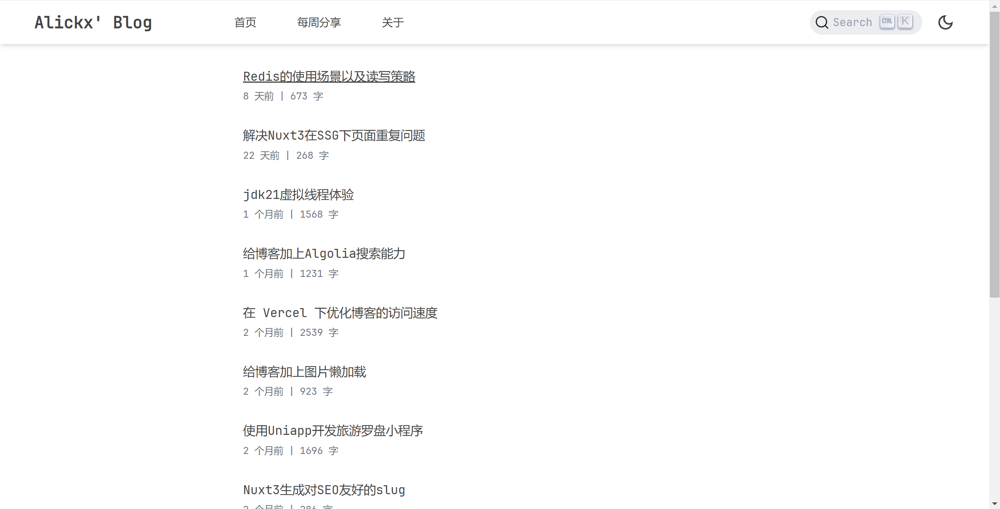
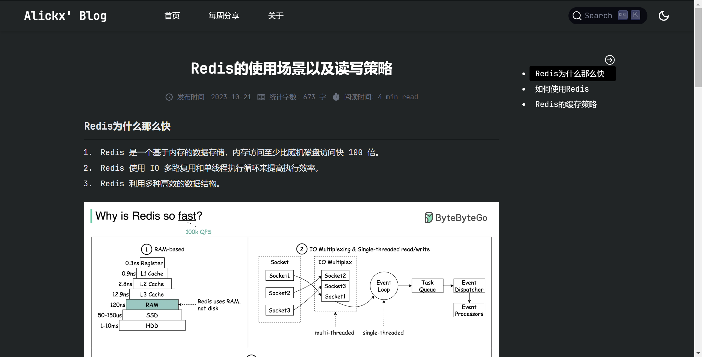
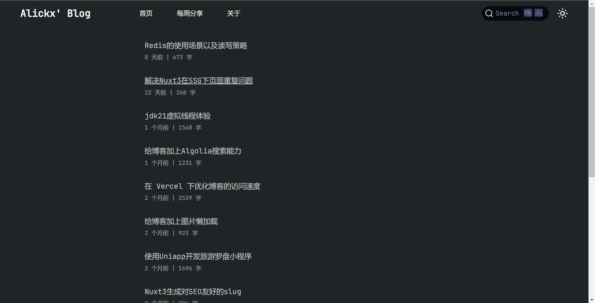

<h1 align="center">Nuxt3-Blog</h1>

<div align="center" style="display: flex; justify-content: center; flex-wrap: wrap; gap: 10px;">
  
  
  
</div>

## 📖 项目介绍

这是一个基于 Nuxt3 + TypeScript + UnoCSS 构建的个人博客网站，用于展示文章、记录生活，以及分享个人日常。项目采用现代前端技术栈，具有响应式布局和深色模式支持，专注于良好的用户体验和性能优化。

## 🛠️ 技术栈

- **Nuxt3**: Vue 的服务端渲染框架，提供优秀的 SEO 支持和性能
- **TypeScript**: 增强代码可维护性和类型安全
- **UnoCSS**: 原子化 CSS 引擎，提高样式开发效率
- **Vite**: 现代前端构建工具，提供极速的开发体验
- **@nuxt/content**: 强大的内容管理系统，方便博客文章的管理
- **Waline**: 轻量级评论系统
- **Algolia**: 高效的站内搜索解决方案
- **Pnpm**: 高性能的包管理工具

## ✨ 主要功能

- ✅ **文章展示**: 支持 Markdown 格式，代码高亮，阅读时间估计
- ✅ **文章搜索**: 集成 Algolia，提供高效的全站搜索体验
- ✅ **响应式布局**: 适配各种设备，从手机到桌面平台
- ✅ **深色模式**: 支持浅色/深色主题切换，保护用户视力
- ✅ **文章评论**: 集成 Waline 评论系统，支持匿名评论
- ✅ **网站 SEO**: 针对搜索引擎优化，提高网站可见性
- ✅ **站点地图**: 自动生成 sitemap.xml，有助于搜索引擎收录

## 🚀 快速开始

### 环境要求

- Node.js 16.x 或更高版本
- pnpm 7.x 或更高版本

### 安装与运行

```bash
# 克隆仓库
git clone https://github.com/yourusername/nuxt3-blog.git
cd nuxt3-blog

# 安装依赖
pnpm install

# 开发模式运行
pnpm dev

# 构建项目
pnpm build

# 预览构建结果
pnpm preview
```

## 📝 内容创作

博客文章存放在 `src/content/_articles` 目录下，使用 Markdown 格式编写。每篇文章需要包含 frontmatter 元数据，例如：

```markdown
---
title: '文章标题'
description: '文章描述'
date: '2023-01-01'
tags: ['标签1', '标签2']
---

文章内容...
```

## 🌐 部署方案

项目采用 Vercel + Cloudflare 的部署方式：

1. **Vercel**: 提供持续集成和部署服务，每次推送代码或添加文章后，会自动触发部署
2. **Cloudflare**: 通过设置 CNAME 记录和 Cloudflare 的 CDN，实现国内无备案域名的访问加速

### 部署步骤

1. 在 Vercel 上导入 GitHub 仓库
2. 配置构建命令 `pnpm build`
3. 设置环境变量（如需要）
4. 设置自定义域名
5. 在 Cloudflare 添加域名并设置 CNAME 记录指向 Vercel 提供的域名

## 🤝 贡献指南

欢迎对本项目做出贡献！无论是提交 bug、改进文档还是添加新功能，您的参与都将使这个项目变得更好。

1. Fork 本仓库
2. 创建您的特性分支: `git checkout -b feature/amazing-feature`
3. 提交您的更改: `git commit -m 'Add some amazing feature'`
4. 推送到分支: `git push origin feature/amazing-feature`
5. 提交 Pull Request

## 📄 许可证

本项目基于 [LICENSE](LICENSE) 开源许可证进行分发和使用。

---

<p align="center">Made with ❤️ by <a href="https://github.com/alickx">alickx</a></p>

